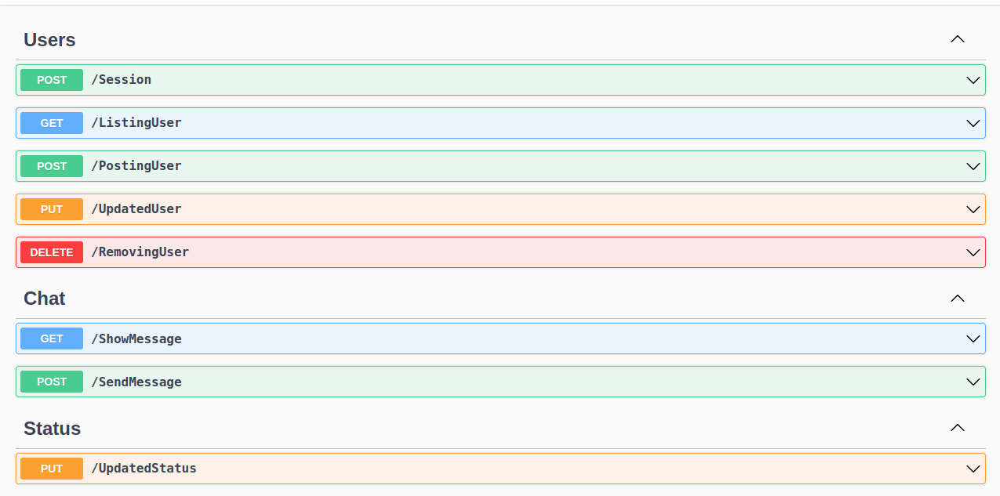

# Open Chat App With SocketIO

<p align="center">
    
</p>

<p align="center">
    
    
    
    
    
</p>

## About:

A chat system is an online service tool that allows instant conversations with your customers. And for that, your buyer doesn't need to install anything. Just access the chat icon or link on your website or social media and send a message.

## Layout:



Image result can be seen on my linkedin - publications:
[mateusmaciel340](https://www.linkedin.com/in/mateusmaciel340/)

## How to run the project?

The steps to access the project are very simple, but follow in the following order:

```bash
npm install
```

Remember to check the schemas created in "schemas" inside "src"

## dotenv (.env)

```bash
PORT_SERVER=8080

PORT=
MONGO_URI=mongodb://localhost:27017/<namedb>
JWT_SECRET=
JWT_EXPIRE=
EMAIL_HOST=
EMAIL_PORT=
EMAIL_USER=
EMAIL_PASS=
EMAIL_FROM=
```

## Technologies:

The following tools were used in building the project:

### Backend (TypeScript)

- TypeScript
- Express
- MongoDB

## Contributors

<table>
    <thead>
        <tr>
            <td>
                
            </td>
        </tr>
    </thead>
    <tbody>
        <tr>
            <th>Mateus Maciel</th>
        </tr>
    </tbody>
</table>

## How to contribute?

1. Fork the project.
2. Create a new branch with your changes: `git checkout -b my-feature`
3. Save the changes and create a commit message telling what you did: `git commit -m Modifying this [...]`
4. Submit your changes: `git push origin my-feature`

## License

This project is under license [MIT](https://github.com/git/git-scm.com/blob/main/MIT-LICENSE.txt).